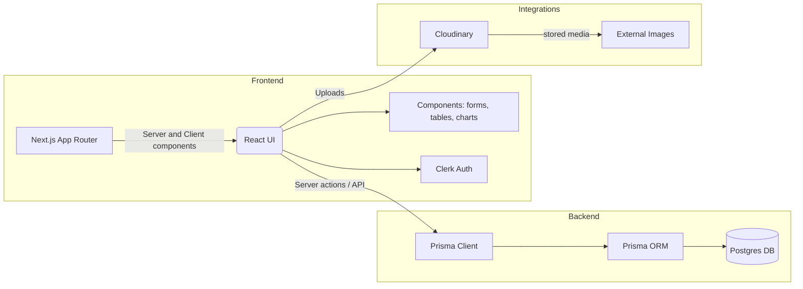

# School Management System — Overview

This document summarizes the codebase from three perspectives: Software Architect, Software Developer, and Product Manager. It highlights architecture, data model, key modules, user flows, and actionable recommendations.

## Table of contents
- [High-level summary](#high-level-summary)
- [Tech stack](#tech-stack)
- [Architecture diagram](#architecture-diagram)
- [Core data model (Mermaid ER)](#core-data-model-mermaid-er)
- [Key modules & file map](#key-modules--file-map)
- [Developer notes (code & maintainability)](#developer-notes-code--maintainability)
- [Architectural considerations (scalability & infra)](#architectural-considerations-scalability--infra)
- [Product perspective (features & UX)](#product-perspective-features--ux)
- [Actionable next steps & questions](#actionable-next-steps--questions)

---

## High-level summary

- Purpose: A Next.js 14 school administration dashboard with role-based views (admin/teacher/parent/student). Core features include class/grade management, students, teachers, lessons, exams, assignments, attendance, events, announcements, and results.
- Backend: Prisma ORM + PostgreSQL (datasource configured in [prisma/schema.prisma](prisma/schema.prisma)).
- Auth: Clerk (`@clerk/nextjs`) for user identity and session management.
- File uploads: Cloudinary (via `next-cloudinary` and `CldUploadWidget`).
- UI: React + Tailwind CSS; charts using `recharts` and calendar with `react-big-calendar`.

## Tech stack

- Frontend: Next.js 14 (app router), React 18, TypeScript.
- Backend access: Prisma Client (see [src/lib/prisma.ts](src/lib/prisma.ts)).
- Auth: Clerk (`@clerk/nextjs`).
- Storage/media: Cloudinary (`next-cloudinary`).
- Validation: Zod + react-hook-form (`zod`, `react-hook-form`, `@hookform/resolvers`).

See package manifest: [package.json](package.json).

## Architecture diagram



## Core data model (Mermaid ER)

```mermaid
erDiagram
  STUDENT {
    String id PK
    String username
    String name
    Date birthday
  }
  TEACHER {
    String id PK
    String username
    String name
  }
  PARENT {
    String id PK
    String username
    String phone
  }
  CLASS {
    Int id PK
    String name
    Int capacity
  }
  GRADE {
    Int id PK
    Int level
  }
  LESSON {
    Int id PK
    Day day
    DateTime startTime
    DateTime endTime
  }

  STUDENT ||--o{ PARENT : belongs_to
  STUDENT }o--|| CLASS : assigned_to
  CLASS }o--|| GRADE : belongs_to
  LESSON }o--|| CLASS : scheduled_in
  LESSON }o--|| TEACHER : taught_by
  TEACHER ||--o{ SUBJECT : teaches
  LESSON ||--o{ EXAM : has
  LESSON ||--o{ ASSIGNMENT : has
  EXAM ||--o{ RESULT : has
  ASSIGNMENT ||--o{ RESULT : has
  STUDENT ||--o{ ATTENDANCE : has
```

Source schema: [prisma/schema.prisma](prisma/schema.prisma).

## Key modules & file map

- Entry & config
  - [next.config.mjs](next.config.mjs)
  - [tsconfig.json](tsconfig.json)
- Data & infra
  - [prisma/schema.prisma](prisma/schema.prisma)
  - [src/lib/prisma.ts](src/lib/prisma.ts) — Prisma client singleton
  - [prisma/seed.ts] (seed script configured in package.json)
- App layout & routing
  - [src/app/layout.tsx] — top-level app layout
  - [src/app/(dashboard)/layout.tsx] — dashboard shell and nested layouts
- UI components (examples)
  - [src/components/Navbar.tsx](src/components/Navbar.tsx)
  - [src/components/Table.tsx](src/components/Table.tsx)
  - [src/components/forms/StudentForm.tsx](src/components/forms/StudentForm.tsx)
- Utilities & mock data
  - [src/lib/data.ts](src/lib/data.ts) — temporary/mock data used in UI
  - [src/lib/utils.ts](src/lib/utils.ts)

## Developer notes (code & maintainability)

- Patterns observed:
  - App uses Next.js App Router with server components for auth-aware server rendering (e.g., `Navbar` uses `currentUser()` server helper).
  - Prisma client is initialized via a singleton to avoid connection explosion in dev server ([src/lib/prisma.ts](src/lib/prisma.ts)).
  - Forms use Zod + react-hook-form; server actions are used for create/update flows (see `StudentForm` calling `createStudent`/`updateStudent` in [src/lib/actions.ts](src/lib/actions.ts)).

- Strengths:
  - Clear domain model in Prisma; good normalization for relational data.
  - Use of Clerk reduces auth complexity and supports role metadata.
  - Strong typed forms and validation via Zod.

- Areas for improvement:
  - Mock data in `src/lib/data.ts` coexists with real DB-backed code — unify or gate via feature flag.
  - `prismaClientSingleton` currently returns a new instance in production path; standard pattern is to create single instance and assign to globalThis only in dev. Consider making the factory idempotent.
  - Error handling in server actions and components needs standardization (consistent toast messages and HTTP status handling).
  - Add unit tests / integration tests for server actions and Prisma queries.

## Architectural considerations (scalability & infra)

- Database:
  - Postgres is a good fit. For scale, add connection pooling (PgBouncer) and ensure Prisma connection reuse across serverless or multi-instance deployments.
  - Consider partitioning or read replicas if user base grows large (attendance and results tables can grow fast).

- Server & deployment:
  - Next.js 14 app router can be deployed on Node servers or serverless platforms. Ensure Prisma connections are handled appropriately (avoid many short-lived connections on serverless).
  - Consider separating heavy background tasks (report generation, bulk imports) into worker processes.

- Media & uploads:
  - Cloudinary used for uploads; consider secure upload tokens and size/type validation.

## Product perspective (features & UX)

- Users & flows observed:
  - Admin: Manage grades, classes, users, view reports and analytics.
  - Teacher: Manage lessons, assign assignments/exams, record attendance, view class lists.
  - Parent: View child attendance, results, events/announcements.
  - Student: View assignments, results, personal info.

- Usability observations:
  - Forms include helpful validation, but onboarding/empty-state UX is unclear (what does a first-time admin do?).
  - Search UI in `Navbar` exists but backend search endpoints are not obvious; implement server-side search for users/records.
  - Calendar and scheduling feature needs clear timezone handling and recurring events support.

## Actionable next steps & questions

- Immediate technical tasks:
  1. Consolidate data sources: remove or gate `src/lib/data.ts` mock data when DB is in use.
  2. Harden `src/lib/prisma.ts` to follow Prisma recommended singleton pattern for both dev and prod.
  3. Add centralized error handling for server actions and consistent toast UX.
  4. Add basic tests for `createStudent`/`updateStudent` server actions and a smoke test hitting the main pages.

- Product/UX tasks:
  1. Define first-time setup flow for Admin (seed minimal data or provide setup wizard).
  2. Implement server-side search and paginated APIs for lists.
  3. Add role-based navigation and explicit access control checks on server actions.

- Questions for stakeholders / next planning session:
  - Expected scale (number of students, teachers) and concurrency requirements?
  - Is multi-tenancy needed (multiple schools)? If yes, data model needs tenant scoping.
  - Backup & compliance requirements (data retention, GDPR)?

---

If you'd like, I can:
- open a PR with the `OVERVIEW.md` and the recommended code edits (Prisma singleton fix, remove mocks),
- implement the Prisma singleton hardening and tests, or
- scaffold the first-time admin setup flow.

File references: [package.json](package.json), [prisma/schema.prisma](prisma/schema.prisma), [src/lib/prisma.ts](src/lib/prisma.ts), [src/components/forms/StudentForm.tsx](src/components/forms/StudentForm.tsx), [src/lib/data.ts](src/lib/data.ts)
